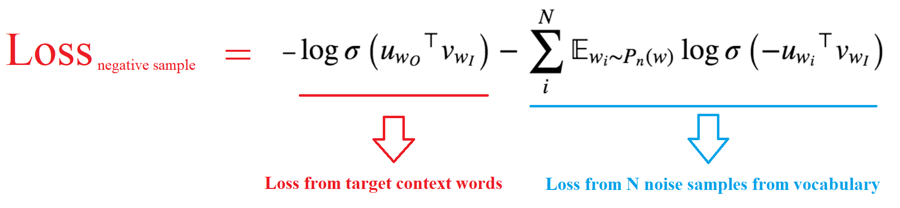

# Skip-Gram with Negative Sampling (PyTorch)

Mapping semantically similar words into closer locations in the embedding space.

## Loss
   
Using **Negative Sampling** (drawing random noise words to form incorrect target pairs), the model tries to minimize the following **Loss Function**:

## Repository Contents

This repository contains:
* **SkipGram_NegativeSampling.py** : Contains the complete source code for pre-processing and batching data, building the model, training the model, and visualizing the resulting word embeddings
* * **util.py** : Contains utility functions for text pre-processing
* data/**text8.txt** : Contains the training text 
* **SkipGram_NegativeSampling.ipynb** : Step-by-step Colab Notebook for pre-processing and batching data, building the model, training the model, and visualizing the resulting word embeddings
		
		
			
## List of Hyperparameters

* Number of Center Words in a Batch = **512**
  * The actual **Batch Size** will vary, since there will be a varying number (in range [1, single_window_size]) of context words for each center word 
* Threshold for Subsampling = **1e-5**  
* Single-side Window Size for Context = **5**  
  * So the whole window contains 5*2+1 = 11 words
* Embedding Dimension = **300** 
* Number of Negative (Noise) Samples Per Center Word = **5**
* Learning Rate = **0.003**
* Number of Training Epochs = **5**

## Sources

I referenced [Udacity](udacity.com) for building & debugging the final model :

* https://github.com/udacity/deep-learning-v2-pytorch
